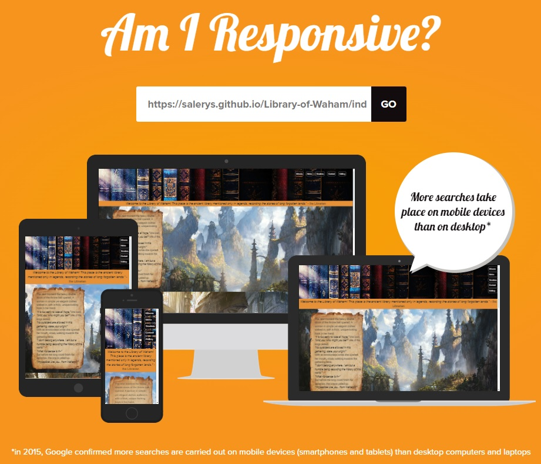
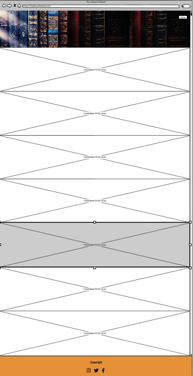
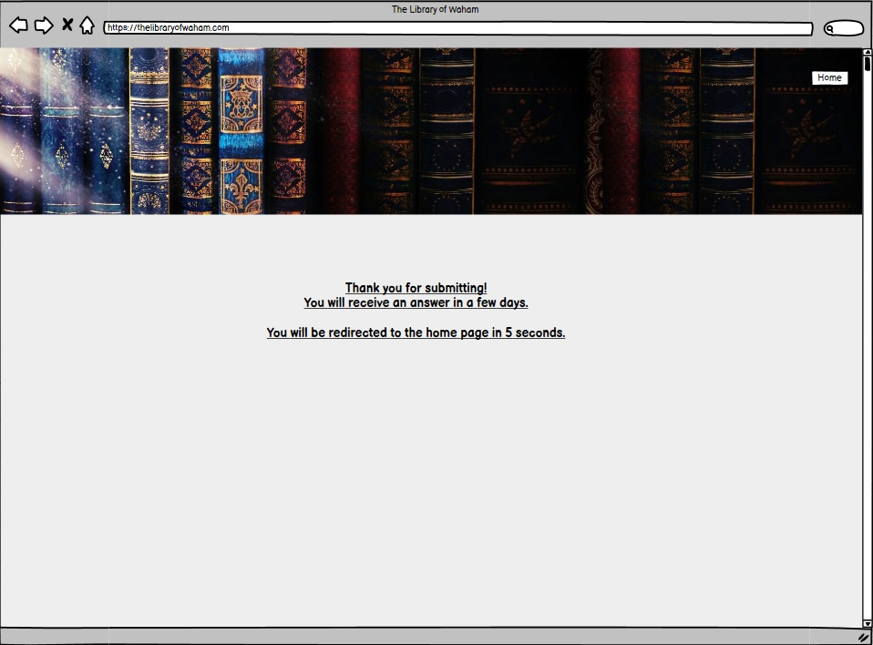
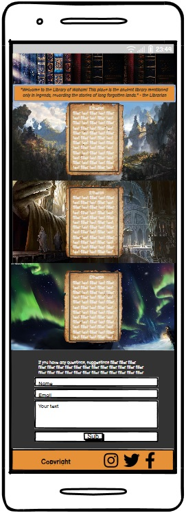
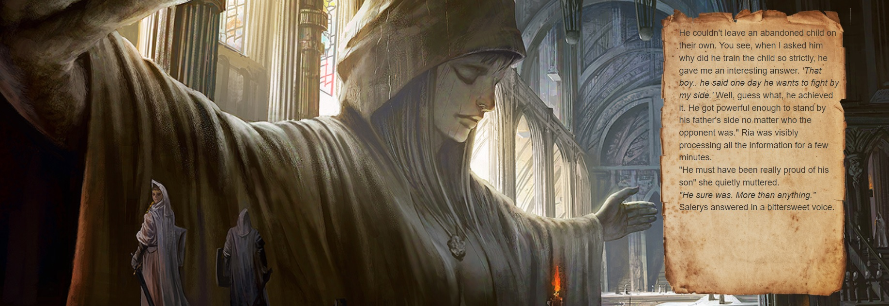
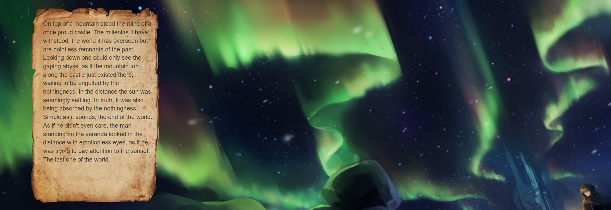
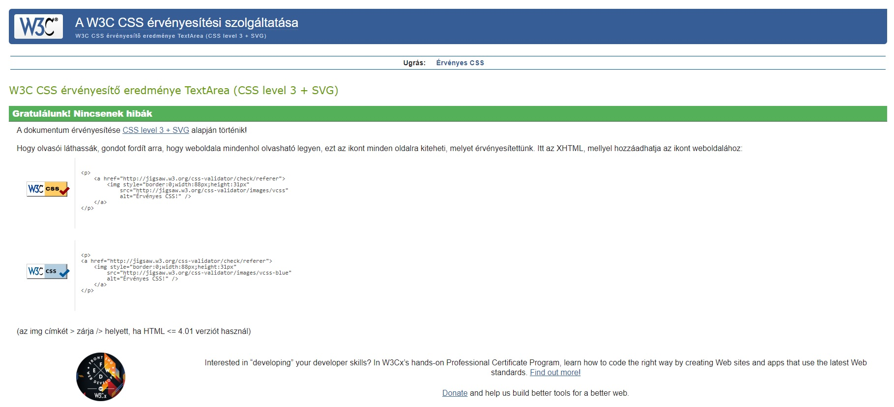
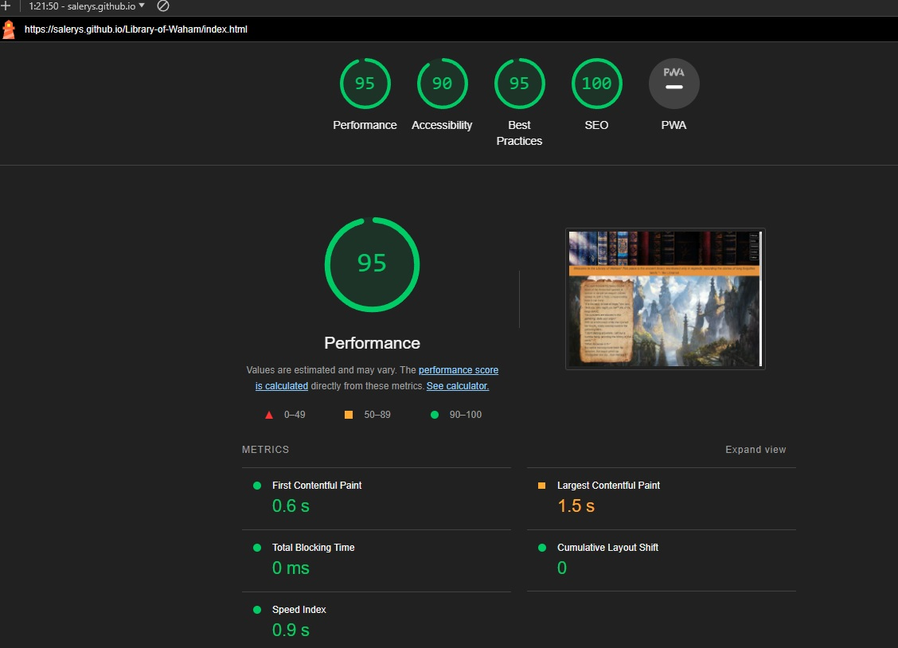

# Library of Waham

Library of Waham is a website made for author Alcor to share his works. The idea came from me writing novels and one-shot stories, and I always wanted a site, and plan to use this in the future and develope it further. The goal is to showcase teasers of some of my works and get the users interested in the site, and my works.

As of now, Library of Waham includes multiple teasers, a Gallery with commissioned concept art, and a working example of a question submit form.

The live link can be found here - [Library of Waham](https://salerys.github.io/Library-of-Waham/index.html)

## My Goals as the Site Owner

- To share my stories that I consider my "lifework" with others, hoping to bring joy to people.
- To inspire others to write, and have them submit questions on how to create their splendid ideas as written stories.
- To create a fan community and see people brainstorm about future chapters and arcs.
- In general, to spread love for fantasy stories.

## User Stories

- ### First time user

  - As a first time user I want to understand the main purpose of the site explore the stories written by the author.
  - As a first time user I want to be able to easily navigate through the website, and have a fun time browsing.
  - As a first time user I want to find new fantasy stories to read.

- ### Returning User

  - As a returning user I want to just quickly hop on the site and choose a story that fits my mood.  
  - As a returning user I want to be able to ask someone more experienced for writing tips and how-to suggestions.

- ### Frequent User

  - As a frequent user I want to join a fan community that can share opinions, guesses and things they like about the stories on the site.
  - As a frequent user I want to contribute to the future of the stories by giving ideas and suggestions to the author for the stories I like.

## Design

### Imagery

The imagery used on the Library of Waham site is very important to the overall experience of the user. Fantasy images fitting the teaser of the stories the user finds on the main page, as this is what grabs their interest at first.
Therefore the images used are fitting the lore of the story.
The images are pleasant to look at, giving a cozy feeling to the user.

### Colours

The colour scheme of the website is grey and orange, to keep it simple to not take any attention away from the displayed stories and their corresponding background photos. The contrast of the orange and grey along with the varying images give an attention-grabbing yet not too straining effect.

### Fonts

The Arial, Helvetica, sans-serif font family was used throughout the whole website. This font was already present using CodeAnywhere, and felt the most fitting from the ones present while creating this project.

## Wireframes

Wireframes were produced using Balsamiq.

 

 
Desktop Wireframe

 

 
 

 
Desktop Wireframe Gallery Page

 

 

 
Desktop Wireframe Thank you redirect page

 

 

    
Mobile Wireframe

 

## Features

- ### Navigation

  - The navigation bar is fully responsive, and redirects to the three story teasers, namely Etheras, Nisha, Timeless, and Contact sections of the same page.
  - The Gallery page has a fully responsive Home button that brings the user back to the homepage.
  - The navigation bar takes place in a horizontal layout on bigger screens, and a vertical layout on smaller screens, in preset positions.
  - The navigation buttons have been styled in a way that the user has an easy time reading and clicking the button to their chosen direction.

- ### The Landing Page Image
  - The landing page includes an eye-catching image with a quote from the novel.
  - This section provides the user with an understanding of the purpose of the site being a novel site.

- ### Etheras Section
  - The Etheras Section gives a teaser of the novel Etheras to pique the interest of the user of the adventure, magic, grief of a far-away world.
  - The background image contains the image of an old document where the story teaser is readable. The document image is set so that on smaller screen it shows mainly with little background image.

- ### Nisha Section
  - The Nisha Section gives a teaser of the novel Nisha the mute Priestess to pique the interest of the user of the journey, companionship, magic and everyday life of the traveling priestess in a fantasy world by introducing Salerys and Ria, the two characters starting the story.
  - The background image contains the image of an old document where the story teaser is readable. The document image is set so that on smaller screen it shows mainly with little background image.

  
- ### Timeless Section
  - The Timeless Section gives a teaser of the novel Hisao, the timeless man to pique the interest of the user of the seemingly endless story, built up with a main storyline and standalone stories of the man cursed with eternal life witnessing many different worlds.
  - The background image contains the image of an old document where the story teaser is readable. The document image is set so that on smaller screen it shows mainly with little background image.

- ### Contact Section

  - The Contact Section gives the user an option to send questions, inquiry, or suggestions to the author.
  - The fill-out form consists of a Name, Email, Text field and a Submit button. The user is unable to press Submit without filling out the fields.

- ### Footer
  - The footer section includes links to Library of Waham's Facebook, Instagram, and Twitter pages that currently don't exist yet at the time of creation for this project
  - The links will open to a new tab to allow easy navigation for the user
  - The footer is crucial to the user, it allows them to find and follow Library of Waham on various social media platforms

### Features Left to Implement

- A button that allows the user to return to the top of the page without having to scroll
- A new novel section where the user is able to find and read the uploaded novel chapters
- A clickable button that allows the user to jump from a present novel teaser to the corresponding novel
- Implementation of a comment system for the fanbase to communicate
- Actual social media profiles

## Testing

### Validator Testing

- #### HTML
  - No errors were returned when passing through the official W3C Markup Validator
    - [W3C Validator Results](https://validator.w3.org/nu/?useragent=Validator.nu%2FLV+http%3A%2F%2Fvalidator.w3.org%2Fservices&acceptlanguage=&doc=https%3A%2F%2Fsalerys.github.io%2FLibrary-of-Waham%2Findex.html)

- #### CSS
  - 3 errors found with the official W3C CSS Validator when using link input to check
  - No errors found with the official W3C CSS Validator when using direct input to check
  - I was informed upon asking, that I don't need to worry about the link input error, as I'm using the Code Institute template, and my ppt1 is running without problem.
    - [W3C CSS Validator Results](https://jigsaw.w3.org/css-validator/validator?uri=https%3A%2F%2Fsalerys.github.io%2FLibrary-of-Waham%2Findex.html&profile=css3svg&usermedium=all&warning=1&vextwarning=&lang=en)
    - 

- #### Accessibility
  - The site achieved a Lighthouse accessibility score of 90% which confirms that while a few improvements could be done with the buttons, the colours and fonts chosen are easy to read and accessible

### Form Testing

- The form has been tested to ensure it would not submit without the required input fields being filled in (full name and email address).

### Links Testing

- All navigation links were tested manually to ensure the user is directed to the correct section of the website.
- Social Media links in the footer of each page were tested manually to ensure they direct the user to the correct page and open in a new tab.

### Browser Testing

- The Website was tested on Google Chrome, Firefox, Microsoft Edge, Opera GX browsers with no major issues noted.

### Device Testing

- The website was viewed on multiple devices to ensure responsiveness on various screen sizes. Everything performed as intended. The responsiveness was also checked using Chrome developer tools across multiple devices for the various sizes.
- I also used the following websites to test responsiveness:
  - [Responsinator](http://www.responsinator.com/?url=https%3A%2F%2Fsalerys.github.io%2FLibrary-of-Waham%2Findex.html)
  - [Am I Responsive](https://ui.dev/amiresponsive?url=https://salerys.github.io/Library-of-Waham/index.html)
  - [AmIResponsive](https://amiresponsive.co.uk)

### Friends and Family User Testing

Friends and family members were asked to review the site to point out any bugs and/or user experience issues.

### Fixed Bugs

#### Home page section text out of intended area on smaller devices

- The three sections in index html ad their text got pushed out of the intended area (the papyrus image) on smaller devices, making the user experience unacceptable
- To solve this I created a media tag for the sections

#### Grid template: column for Gallery didn't work as intended

- When I first implemented Grid for the Gallery page I tried setting a template:column autofit minmax css code as previously showcased by our coordinator and course group members, which caused the page to look empty and unprofessional on bigger screen size.
- No matter how I tried, if I made it look as intended on bigger screen size, on phone devices it became scuffed, the images being wider than the body/header.
- Having consulted people we still haven't found the solution, so I have settled with deleting the minmaxing code line, changing the style to the current one, where the user has to scroll through the pictures.

### Known Bugs

Implemented "_blank" code for Gallery images downloads the image instead of opening then on a new tab on certain browsers.

## Technologies Used

### Languages

- HTML5
- CSS

### Frameworks - Libraries - Programs Used

- [Am I Responsive](http://ami.responsivedesign.is/) - Used to verify responsiveness of website on different devices.
- [Responsinator](http://www.responsinator.com/) - Used to verify responsiveness of website on different devices.
- [AmIResponsive](https://amiresponsive.co.uk) - Used to verify responsiveness of website on different devices.
- [Balsamiq](https://balsamiq.com/) - Used to generate Wireframe images.
- [Chrome Dev Tools](https://developer.chrome.com/docs/devtools/) - Used for overall development and tweaking, including testing responsiveness and performance.
- [Opera GX Dev Tools](https://dev.opera.com/extensions/testing/) - Used for overall development and tweaking, including testing responsiveness and performance.
- [Font Awesome](https://fontawesome.com/) - Used for Social Media icons in footer.
- [GitHub](https://github.com/) - Used for version control and hosting.
- [TinyPNG](https://tinypng.com/) - Used to compress images to reduce file size without a reduction in quality.
- [W3C](https://www.w3.org/) - Used for HTML & CSS Validation.
- [icons8](https://icons8.com/) - Used for favicon.

## Deployment

The project was deployed using GitHub pages. The steps to deploy using GitHub pages are:

1. Go to the repository on GitHub.com
2. Select 'Settings' near the top of the page.
3. Select 'Pages' from the menu bar on the left of the page.
4. Under 'Source' select the 'Branch' dropdown menu and select the main branch.
5. Once selected, click the 'Save'.
6. Deployment should be confirmed by a message on a green background saying "Your site is published at" followed by the web address.

The live link can be found here - [Library of Waham](https://github.com/Salerys/Library-of-Waham)

## Credits

### Content

- All Gallery concept art were created by my sister.
- All novels shown in teasers as well the Author name is me, and are created by me.

### Media

All images and videos were sourced from the below websites with huge thanks to their creator.

- [DeviantArt](https://www.deviantart.com)
  - ftourini - old paper stock 01 and 02
  - Glowsydoodles - the forbidden library
- [Pixiv](https://pixiv.net)
  - Feesh - 【PFNW】守護者の地
  - のば - 【PFFK】ガラリスの大列柱教会跡と聖母像【巡礼者の依頼】
  - Alayna Danner - Wind Vale

### Resources Used

- Inspiration for grid css code - Dajana (student in the _5P group like me) and her amazing project [Isbaner Vineyard](https://queenisabaer.github.io/isbaner-vineyard/index.html)
- Inspiration for the README file from AliOKeeffee, suggested by my mentor Antonio - [Mind Yoga](https://github.com/AliOKeeffe/mindyoga/tree/main)

## Acknowledgments

My mentor Antonio for his support and advice.

The Code Institute slack community for their quick responses and very helpful feedback, especially Kay_ci.

My real life friends Matthew and Thomas who answered all my silly questions a beginner coder can have.
